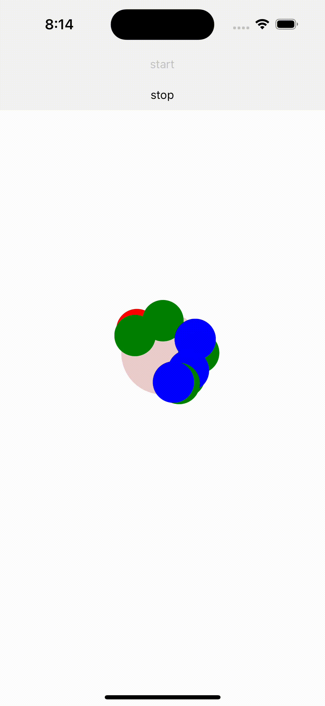
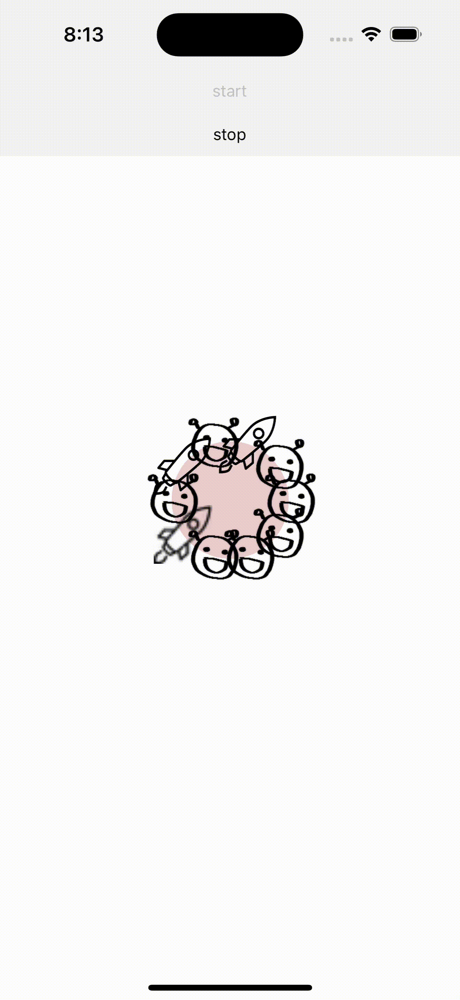
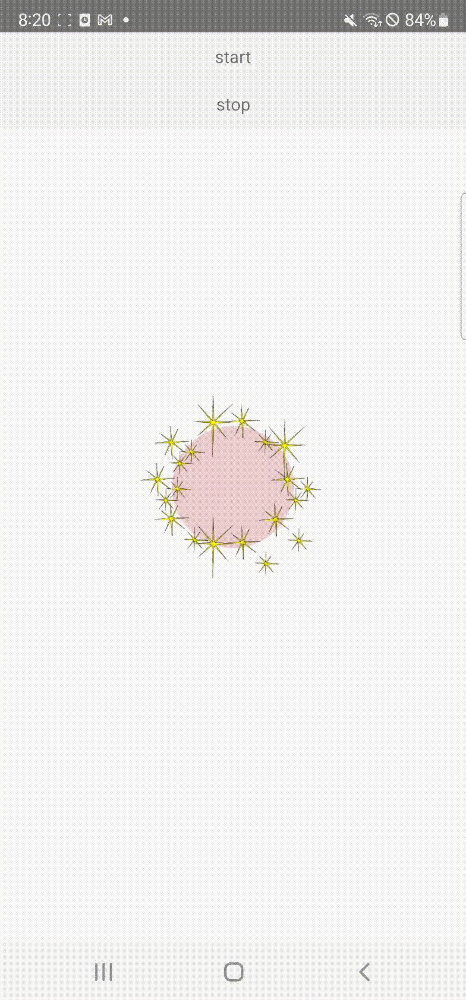
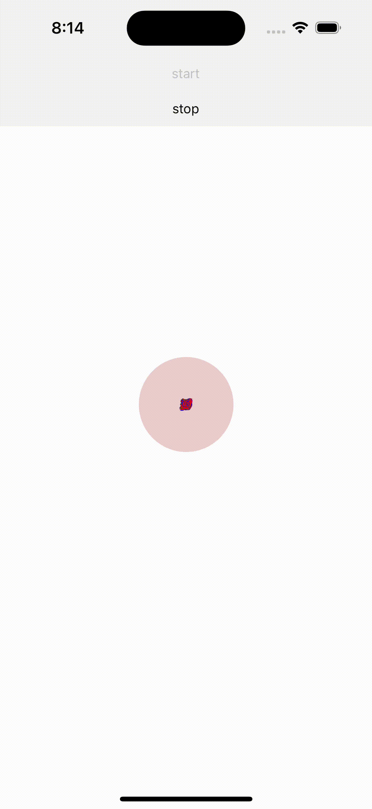

# react-native-SLLFireworks


A React Native project that can be used to highlight something important or to express fireworks.

## Prerequisites

---------
[react nataive reanimated install guide](https://docs.swmansion.com/react-native-reanimated/docs/fundamentals/installation)
```
npm i react-native-reanimated
```
## Props.

---------
| Attribute Name   | type                          | Description                                                                                                                                                                    | Default              | Option |
|------------------|-------------------------------|--------------------------------------------------------------------------------------------------------------------------------------------------------------------------------|----------------------|-------|
| ref              | useRef()                      | `fireworksRef` is a variable representing the reference of the `SLLFireworks` component. It allows accessing the methods or properties of the component.                       | useRef()             | X     | 
| positionX        | number                        | It represents the X-coordinate position of the `SLLFireworks` component.                                                                                                       | random               | O     |
| positionY        | number                        | It represents the Y-coordinate position of the `SLLFireworks` component.                                                                                                       | random               | O     | 
| particleSize     | number                        | It specifies the size of each firework or particle in pixels.                                                                                                                  | Image size or 30     | O     |
| radius           | number                        | It represents the maximum radius within which the firework or particle can move. The value is specified in pixels.                                                             | 200                  | O     |
| innerRadius      | number                        | It represents the inner radius of the firework or particle. It determines the shape of the firework. The value is specified in pixels.                                         | 0                    | O     | 
| radiusNoise      | number                        | It indicates the amount of noise added to the particle's radius. A larger value will make the particle move in a more irregular path. The value is specified in pixels.        | 0                    | O     | 
| zIndex           | number                        | It represents the stacking order of the component. A higher value means it will be displayed on top.                                                                           | default              | O     |
| iteration        | number                        | It denotes the number of times the firework animation will repeat. If set to 1, the animation will run once.                                                                   | 1                    | O     |
| numberOfParticle | number                        | It represents the number of particles generated.                                                                                                                               | 20                   | O     |
| particleSources  | Array(local image, uri image) | It is an array of image sources used for the firework or particle.                                                                                                             | Circle particle view | O       |
| autoStart        | boolean                       | It indicates whether the component will automatically start the animation. If set to true, the animation will start automatically when the component is rendered.              | false                | O     |
| animationDuration | number(miliseconds)           | It specifies the duration of the firework animation in milliseconds.                                                                                                           | 500                  | O     |
| onAnimationDone  | funcrion                      | It is a callback function that is called when the animation is completed. The `onAnimationDone` function can be used to perform any desired action when the animation is done. | undefined            | O     |
| angleType        | string (equal, random)        | It determines the movement angle of the particle. When set to 'equal', particles move at the same angle.                                                                       | 'random'             | O     | 
| particleColors	  | Array<string>	                | It is an array of color values that can be assigned to each particle. Each particle can have a different color.| ['black'] or null    | O     |

## Ref Handler

---------
| Function | Description                                              |
|----------|----------------------------------------------------------|
| start    | Initiates the fireworks animation.                        |
| stop     | Halts the fireworks animation.                            |

## Ref function Example

---------
```
<View>
      {/* start button */}
      <TouchableOpacity style={styles.simpleButton}
                        onPress={()=>{
                          if(fireworksRef.current != null){
                                // Start the fireworks animation.
                                fireworksRef.current.start();
                            }
                        }
                        }>
        <Text>start</Text>
      </TouchableOpacity>
      {/* stop button */}
      <TouchableOpacity style={styles.simpleButton} 
                      onPress={()=>{
                        if(fireworksRef.current != null){
                            // Stop the fireworks animation.
                            fireworksRef.current.stop();
                          }
                      }
                     }>
        <Text>stop</Text>
      </TouchableOpacity>
    </View>
```
## Example

---------
## Circle Type





```
<SLLFireworks
        ref={fireworksRef}
        positionX={WIN_WIDTH/2}
        positionY={WIN_HEIGHT/2}
        particleSize={50}
        radius={100}
        innerRadius={40}
        radiusNoise={100}
        zIndex={100}
        iteration={1}
        numberOfParticle={10}
        particleColors={['red', 'blue', 'green']}
        autoStart={false}
        animationDuration={500}
        onAnimationDone={onAnimationDone}
        angleType={'random'}
      />
```

## Image Type







```
<SLLFireworks
      ref={fireworksRef}
      positionX={WIN_WIDTH/2}
      positionY={WIN_HEIGHT/2}
      particleSize={50}
      radius={100}
      innerRadius={50}
      radiusNoise={100}
      zIndex={100}
      iteration={1}
      numberOfParticle={10}
      particleSources={[require('./star_01.png'), require('./star_02.png'), require('./star_03.png')]}
      autoStart={true}
      animationDuration={500}
      onAnimationDone={onAnimationDone}
      angleType={'equal'}
/>
```

## Local Image, Server Image Mix Type



```
<SLLFireworks
        ref={fireworksRef}
        positionX={WIN_WIDTH/2}
        positionY={WIN_HEIGHT/2}
        particleSize={10}
        radius={100}
        innerRadius={0}
        radiusNoise={10}
        zIndex={100}
        iteration={1}
        numberOfParticle={100}
        particleSources={[require('./sample.png'), {uri: "https://img.icons8.com/ios/250/000000/rocket.png"}]}
        particleColors={['red', 'blue', 'green']}
        autoStart={false}
        animationDuration={500}
        onAnimationDone={onAnimationDone}
        angleType={'random'}
/>
```
